# Trabalho Prático

Esse é um Trabalho Prático desenvolvido como parte da disciplina de Programação Orientada a Objetos, do Curso de Sistemas de Informação, sob comando do Prof. Eduardo Pelli.

# Autores

- Alan Barbosa Lima [@AlanLima287](https://github.com/AlanLima287)
- Juan Pablo Ferreira Costa [@juan-ferreirax](https://github.com/juan-ferreirax)

# Padronização

- Tipos devem sempre ser compatíveis, logo conversões devem ser sempre explicitas, mesmo que a conversão implicita seja garantida;
- Apenas expressões com resultado booleano são premitidas dentro das condições de if's, while's e for's;
- Todo if's, while's e for's deve ter um bloco delimitado por chaves associado, mesmo que seja composto por uma única sentença;
- Caso uma função tenha mais de duas sentenças significativas, this é obrigatório para referênciar variáveis de instância;
- Caso um atributo tenha mais de um getter/setter, o getter/setter padrão deve vir primeiro e imediatamente abaixo todos os outros deve ser postos;
- O bloco de getters de um atributo deve vir imediatamente antes do bloco de setters;
- Os blocos de getters e setters devem aparecer na mesma ordem que a declaração de seus atributos;
- A ordem de estruturação de uma classe deve ser:
    - atributos (constantes ou não),
    - intancia da própria classe (para singletons),
    - construtores,
    - método getInstance (para singletons),
    - enums,
    - atributos de classe (constantes ou não),
    - getters e setters,
    - a substituição do metodo toString,
    - métodos parametrizados (que não são getters nem setters),
    - estruturas auxiliáres (classes, interfaces, exceções, etc).

# Estrutura do Projeto

- visual\
    - gui\
    - tui\
    - Functional.java
    - Strings.java
- main\
    - auth\
        - Account.java
        - Authenticator.java
    - financial\
        - Expense.java
        - Invoice.java
    - common\
        - Cpf.java
        <!-- - Decimal.java -->
        - Person.java
        - Phone.java
        - Vehicle.java
    - customer\
        - Customer.java
    - exceptions\
    - workshop\
        - personnel\
            - Employee.java
            - Manager.java
            - Shift.java
        - service\
            - Elevator.java
            - Maintenance.java
            - Part.java
            - Scheduler.java
            - Scheduling.java
            - Service.java
        - Workshop.java
    
## Diagrama de Classes

```mermaid
classDiagram

class Account {
    ...
}

class Authenticator {
    ...
}

class Expense {
    ...
}

class Invoice {
    ...
}

    class Cpf {
        - cpf long

        + Cpf()
        + Cpf(String)

        + getFullCpf() String
        + getCpf() String
        + setCpf(String)
    }

    class Decimal {
        - decimal: long

        + Decimal()
        + Decimal(long)
        + Decimal(double)
        + Decimal(String)

        + add(Decimal) Decimal
        + sub(Decimal) Decimal
        + mul(Decimal) Decimal
        + div(Decimal) Decimal

        + getDecimal() double
        + setDecimal(double)
    }

    class Person {
        - name: String
        - phone: Phone
        - cpf: Cpf

        + getName() String
        + setName(String)
        + getPhone() String
        + setPhone(String) 
        + getCpf() String
        + setCpf(String)
    }

    class Phone {
        - phone: long

        + getPhone() String
        + setPhone(String)
    }

class Vehicle {
    ...
}

class Customer {
    ...
}

class Employee {
    ...
}

class Manager {
    ...
}

class Shift {
    ...
}

class Elevator {
    ...
}

class Maintenance {
    ...
}

class Part {
    ...
}

class Scheduler {
    ...
}

class Scheduling {
    ...
}

class Service {
    ...
}

class Workshop {
    ...
}

class Vehicle {
    - modelo: String
    - placa: String
    - ano: int

    + getModelo() String
    + setModelo(String)
    + getPlaca() String
    + setPlaca(String)
    + getAno() int
    + setAno(int)
}
```

# Referências

https://docs.oracle.com/javase/tutorial/java/concepts/interface.html
https://docs.oracle.com/javase/tutorial/java/generics/types.html
https://docs.oracle.com/javase/tutorial/extra/generics/methods.html
https://github.com/AlanLima287/Binary_Tree/
https://github.com/dialex/JColor/
https://www.debuggex.com/