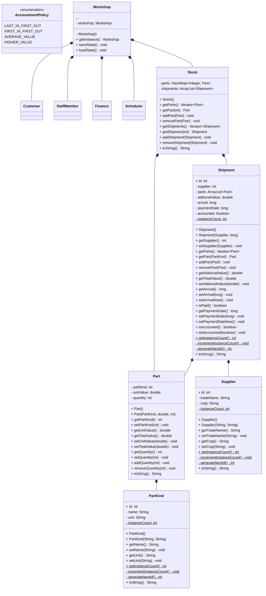

# Sistema de Gerenciamento para uma Oficina Mecânica

Esse é um sistema de gerenciamento para uma oficina mecânica, que abrange diversas funcionalidades como agendamento de serviços, controle de estoque, gestão financeira e cadastro de clientes e veículos e gerenciamento de estoque.

## Objetivo Geral

Aplicar os conceitos de Programação Orientada a Objetos (POO) para desenvolver um sistema de gerenciamento de uma oficina mecânica, utilizando Java como linguagem de programação.

## Autores

- Alan Barbosa Lima         [@alan-b-lima](https://github.com/alan-b-lima)
- Juan Pablo Ferreira Costa [@juan-ferreirax](https://github.com/juan-ferreirax)

## Estrutura do Projeto

O projeto é estruturado em duas partes principais: **Modelo** (Backend) e **Visual** (Frontend).

### Padronização de Código

- Conversões devem ser sempre explicitas, mesmo que a conversão implicita seja garantida;
- Todo `if`, `while` e `for` deve ter um bloco delimitado por chaves associado, mesmo que seja composto por uma única sentença;
- Caso uma função tenha mais de duas sentenças significativas, `this` é obrigatório para referênciar variáveis de instância;
- Caso um atributo tenha mais de um getter/setter, o getter/setter padrão deve vir primeiro e imediatamente abaixo todos os outros deve ser postos;
- O bloco de getters de um atributo deve vir imediatamente antes do bloco de setters;
- Os blocos de getters e setters devem aparecer na mesma ordem que a declaração de seus atributos;
- A ordem de estruturação de uma classe deve ser:
    - atributos (constantes ou não),
    - instância da própria classe (para singletons),
    - construtores,
    - método getInstance ou equivalente (para singletons),
    - atributos de classe (constantes ou não),
    - getters e setters,
    - outros métodos (que não são getters nem setters),
    - a substituição do metodo toString.

## Modelo

- model\
    - auth\
        - [ ] AuthLevel.java
        - [ ] Session.java
    - util\
        - [ ] WJson.java
    - workshop\
        - common\
            - [x] Cpf.java
            - [x] Person.java
            - [x] Phone.java
        - customer\
            - [ ] Customer.java
            - [ ] Vehicle.java
        - date\
            - [ ] DateSpan.java
            - [ ] Schedule.java
            - [ ] WDate.java
        - financial\
            - [ ] Finance.java
            - [ ] Expense.java
            - [ ] Invoice.java
        - service\
            - [ ] Elevator.java
            - [ ] Scheduler.java
            - [ ] Scheduling.java
            - [ ] Service.java
            - [ ] ServiceOrder.java
        - staff\
            - [ ] Employee.java
            - [ ] Manager.java
            - [ ] StaffMember.java
        - stock\
            - [ ] Part.java
            - [x] PartKind.java
            - [ ] Shipment.java
            - [ ] Stock.java
            - [ ] Supplier.java
        - [ ] Workshop.java

### Diagrama de Classes

## Visual

- visual\
    - gui\
    - tui\
        - command\
            - [ ] Help.java
            - [ ] Login.java
            - ...
        - [ ] Command.java
        - [ ] CommandLine.java
        - [ ] Main.java

## Referências

- https://docs.oracle.com/javase/tutorial/java/concepts/interface.html
- https://docs.oracle.com/javase/tutorial/java/generics/types.html
- https://docs.oracle.com/javase/tutorial/extra/generics/methods.html
- https://github.com/AlanLima287/Binary_Tree/
- https://github.com/dialex/JColor/
- https://www.debuggex.com/
- https://github.com/google/gson
- https://mermaid.js.org/syntax/classDiagram.html