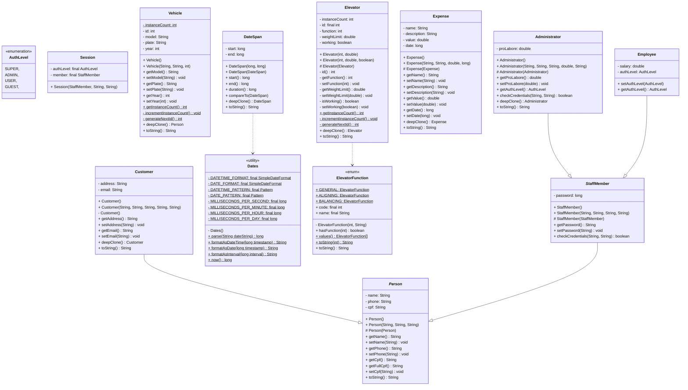
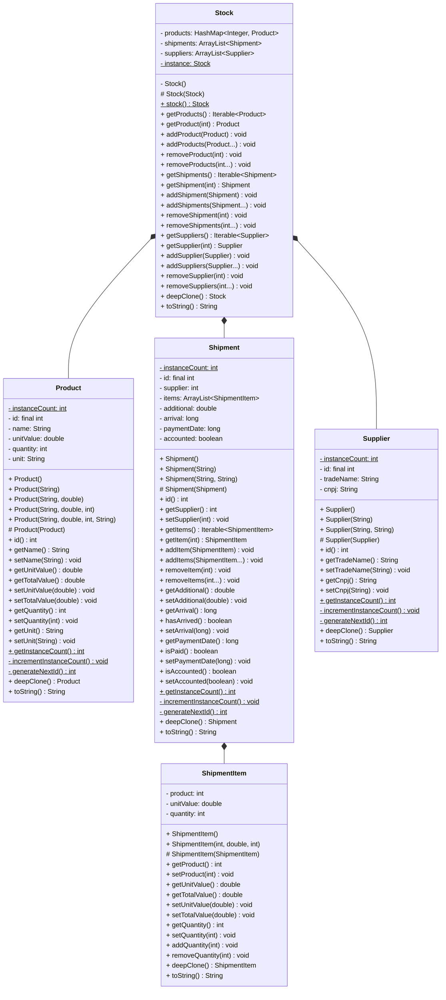

# Sistema de Gerenciamento para uma Oficina Mecânica

Esse é um sistema de gerenciamento para uma oficina mecânica, que abrange diversas funcionalidades como agendamento de serviços, controle de estoque, gestão financeira e cadastro de clientes e veículos e gerenciamento de estoque.

## Objetivo Geral

Aplicar os conceitos de Programação Orientada a Objetos (POO) para desenvolver um sistema de gerenciamento de uma oficina mecânica, utilizando Java como linguagem de programação.

## Autores

- Alan Barbosa Lima         [@alan-b-lima](https://github.com/alan-b-lima)
- Juan Pablo Ferreira Costa [@juan-ferreirax](https://github.com/juan-ferreirax)

## Estrutura do Projeto

O projeto é estruturado em duas partes principais: **Modelo** (Backend) e **Visual** (Frontend).

### Padronização de Código

- Conversões devem ser sempre explicitas, mesmo que a conversão implicita seja garantida;
- Todo `if`, `while` e `for` deve ter um bloco delimitado por chaves associado, mesmo que seja composto por uma única sentença;
- Caso uma função tenha mais de duas sentenças significativas, `this` é obrigatório para referênciar variáveis de instância;
- Caso um atributo tenha mais de um getter/setter, o getter/setter padrão deve vir primeiro e imediatamente abaixo todos os outros deve ser postos;
- Bloco de getters de um atributo deve vir imediatamente antes do bloco de setters;
- Blocos de getters e setters devem aparecer na mesma ordem que a declaração de seus atributos;
- A ordem de estruturação de uma classe deve ser:
    - atributos de classe (constantes ou não),
    - atributos (constantes ou não),
    - instância da própria classe (para singletons),
    - construtores,
    - método getInstance ou equivalente (para singletons),
    - getters e setters,
    - outros métodos (que não são getters nem setters),
    - substituições em geral,
    - substituição do método toString, e
    - classes internas;
- Uma exceção deve ser lançada com resposta a uma condição atômica, salvo casos onde se entende maior benefício na violação dessa regra;
- Mensagens lançadas em excessões deve ser em caixa baixa, exceto para unidades capitalizadas por padrão, tal como CPF ou LaTeX;
- Mensagens lançadas em excessões devem ser orações declarativas, na estrutura `<sujeito>` `<predicado>`, com:
    - sujeito sem artigo, e
    - predicado deve conter um verbo ou locução verbal, negada ou não, que indique claramente como o sujeito causou a exceção a ser lançada.

## Modelo

- model\
    - auth\
        - [ ] Authenticable.java
        - [ ] AuthLevel.java
        - [ ] Session.java
    - custom\
        - [ ] DeepClonable.java
        - [ ] WorkshopObject.java
    - exception\
        - [ ] WorkshopException.java
    - persistence\
        - [ ] History.java
        - [ ] Snapshot.java
        - [ ] WJson.java
    - workshop\
        - common\
            - [x] Customer.java
            - [x] Person.java
            - [ ] Vehicle.java
        - date\
            - [x] Dates.java
            - [x] DateSpan.java
        - financial\
            - [ ] Finance.java
            - [x] Expense.java
            - [ ] Invoice.java
        - service\
            - [x] Elevator.java
            - [x] ElevatorElevator.java
            - [ ] Scheduler.java
            - [ ] Service.java
            - [ ] ServiceOrder.java
        - staff\
            - [ ] Administrator.java
            - [ ] Employee.java
            - [ ] StaffMember.java
        - stock\
            - [x] Product.java
            - [x] Shipment.java
            - [x] ShipmentItem.java
            - [x] Stock.java
            - [x] Supplier.java
        - [ ] Workshop.java
    - [ ] WorkshopSystem.java

### Diagrama de Classes



#### Estoque



## Visual

- visual\
    - gui\
    - tui\
        - entry\
            - CommandEntry.java
            - ContextEntry.java
            - Entry.java
        - exit\
            - ExitCode.java
            - ExitMessage.java
        - Command.java
        - Commands.java
        - Shell.java
        - Main.java
```

### Diagrama de classes

```mermaid
classDiagram

```

## Referências

- https://docs.oracle.com/javase/tutorial/java/concepts/interface.html
- https://docs.oracle.com/javase/tutorial/java/generics/types.html
- https://docs.oracle.com/javase/tutorial/extra/generics/methods.html
- https://github.com/AlanLima287/Binary_Tree/
- https://github.com/dialex/JColor/
- https://www.debuggex.com/
- https://github.com/google/gson
- https://mermaid.js.org/syntax/classDiagram.html
- https://www.javier8a.com/itc/bd1/articulo.pdf
- https://emerson.emory.edu/services/latex/latex_143.html
- https://tikz.dev/gd-layered
- https://tex.stackexchange.com/questions/69439/how-can-i-achieve-relative-positioning-in-tikz
- https://www.omg.org/spec/UML/2.5/PDF
- https://tex.stackexchange.com/questions/616317/tikz-determining-the-size-in-cm-of-a-finished-tikz-picture