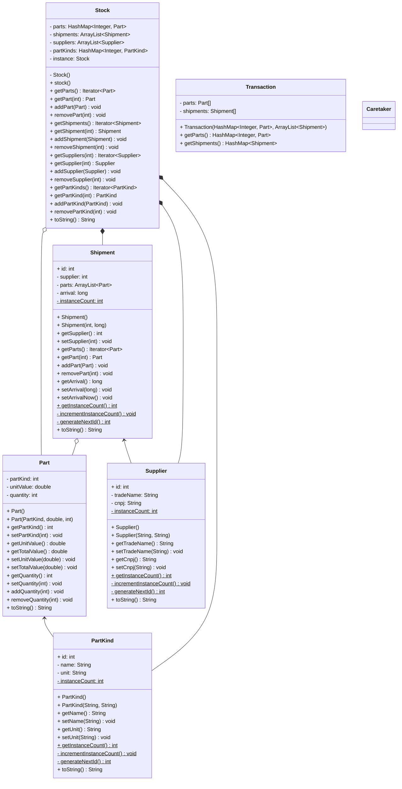

# Trabalho Prático II - Padrões de Projeto - Memento

Sem violar o encapsulamento, captura e externaliza o estado interno de um objeto, de tal forma que o objeto possa ser restaurado a esse estado mais tarde.

## Apresentação

1. Apresentação da equipe
1. Apresentação do tema
1. 

## Aplicação

## Referências

- https://www.javier8a.com/itc/bd1/articulo.pdf