# Trabalho Prático

Esse é um Trabalho Prático desenvolvido como parte da disciplina de Programação Orientada a Objetos, do Curso de Sistemas de Informação, sob comando do Prof. Eduardo Pelli.

# Autores

- Alan Barbosa Lima [@alan-b-lima](https://github.com/alan-b-lima)
- Juan Pablo Ferreira Costa [@juan-ferreirax](https://github.com/juan-ferreirax)

# Padronização

- Tipos devem sempre ser compatíveis, logo conversões devem ser sempre explicitas, mesmo que a conversão implicita seja garantida;
- Todo if's, while's e for's deve ter um bloco delimitado por chaves associado, mesmo que seja composto por uma única sentença;
- Caso uma função tenha mais de duas sentenças significativas, this é obrigatório para referênciar variáveis de instância;
- Caso um atributo tenha mais de um getter/setter, o getter/setter padrão deve vir primeiro e imediatamente abaixo todos os outros deve ser postos;
- O bloco de getters de um atributo deve vir imediatamente antes do bloco de setters;
- Os blocos de getters e setters devem aparecer na mesma ordem que a declaração de seus atributos;
- A ordem de estruturação de uma classe deve ser:
    - atributos (constantes ou não),
    - intancia da própria classe (para singletons),
    - construtores,
    - método getInstance (para singletons),
    - enums,
    - atributos de classe (constantes ou não),
    - getters e setters,
    - outros métodos (que não são getters nem setters),
    - a substituição do metodo toString,
    - estruturas auxiliáres (classes, interfaces, exceções, etc).

# Estrutura do Projeto

- controller\
- exceptions\
- model\
    - auth\
        - [ ] AuthLevel.java
        - [ ] Session.java
    - util\
        - [ ] WJson.java
        - [ ] WDate.java
    - workshop\
        - common\
            - [x] Cpf.java
            - [x] DateSpan.java
            - [x] Person.java
            - [x] Phone.java
        - customer\
            - [x] Customer.java
            - [x] Vehicle.java
        - financial\
            - [ ] FinancialManager.java
            - [ ] Expense.java
            - [ ] Invoice.java
        - service\
            - [ ] Elevator.java
            - [ ] Scheduler.java
            - [ ] Scheduling.java
            - [ ] Service.java
            - [ ] ServiceOrder.java
        - staff\
            - [ ] Employee.java
            - [ ] Manager.java
            - [ ] StaffMember.java
        - stock\
            - [ ] Part.java
            - [ ] PartKind.java
            - [ ] Shipment.java
            - [ ] Stock.java
        - [ ] Workshop.java
- visual\

## Diagrama de Classes

```mermaid
classDiagram

    class AuthLevel {
        ...
    }

    class Session {
        ...
    }

    class WJson {
        ...
    }

    class WDate {
        ...
    }

    class Cpf {
        - cpf: long

        + Cpf()
        + Cpf(String)

        + getCpf() String
        + getFullCpf() String
        + getNumericCpf() String
        + setCpf(String) void

        + toString() String
    }

    class DateSpan {
        - start: long
        - end: long

        + DateSpan()
        + DateSpan(long)
        + DateSpan(long, long)

        + getStart() long
        + setStart(long) void
        + setStartNow() void
        + getEnd() long
        + setEnd(long) void
        + setEndNow() void

        + toString() String
    }

    Cpf *-- Person
    Phone *-- Person
    class Person["_Person_"] {
        - name: String
        - phone: Phone
        - cpf: Cpf

        + Person()
        + Person(String, String, String)

        + getName() String
        + setName(String) void
        + getPhone() String
        + setPhone(String) void
        + getCpf() String
        + getFullCpf() String
        + getNumericCpf() long
        + setCpf(String) void

        + toString() String
    }

    class Phone {
        - phone: long

        + Phone()
        + Phone(String)

        + getPhone() String
        + setPhone(String) void

        + toString() String
    }

    class Customer {
        - address: String

        + Customer()
        + Customer(String, String, String, String)

        + getAddress() String
        + setAddress(String) void

        + toString() String
    }

    class Vehicle {
        - model: String
        - plate: String
        - year: int

        + Vehicle()
        + Vehicle(String, String, int)

        + getModel() String
        + setModel(String) void
        + getPlate() String
        + setPlate(String) void
        + getYear() int
        + setYear(int) void

        + toString() String
    }

    class FinancialManager {

    }

    class Expense {
        - name: String
        - description: String
        - value: double
        - date: long

        + Expense()
        + Expense(String, String, double, long)

        + getName() String
        + setName(String) void
        + getDescription() String
        + setDescription(String) void
        + getValue() double
        + setValue(double) void
        + getDate() long
        + setDate(long) void

        + toString() String
    }

    class Invoice {
        ...
    }

    class Elevator {
        - tasks: TreeSet<DateSpan>
        - weightLimit: double

        + Elevator()
        + Elevator(double)

        + getSchedule() DateSpan[]
        + getSchedule(long, long) DateSpan[]
        + getRecentSchedule() DateSpan
        + addSchedule(DateSpan) void
        + getWeightLimit() double
        + setWeightLimit(double) void

        + toString() String
    }

    class Scheduler {
        ...
    }

    class Scheduling {
        ...
    }

    class Service {
        ...
    }

    class ServiceOrder {
        ...
    }

    Employee --|> StaffMember
    class Employee {
        - shifts: TreeSet<DateSpan>

        + Employee()
        + Employee(String, String, String, String, double, String)

        + getShifts() DateSpan[]
        + getShifts(long, long) DateSpan[]
        + getRecentShift() DateSpan
        + addShift(DateSpan) void
        + removeShift(DateSpan) void
    }

    Manager --|> StaffMember
    class Manager {
        ...
    }

    StaffMember --|> Person
    class StaffMember["_StaffMember_"] {
        + id: int
        - salary: double
        - password: long

        + StaffMember()
        + StaffMember(String, String, String, String, double, String)

        - instanceCount: int $

        + getId() long
        + getSalary() double
        + setSalary(double) void
        + getPassword() String
        + setPassword(String) void

        - getInstanceCount() int $
        - incrementInstanceCount() void $
        - nextId() int $

        + toString() String
    }

    class Part {
        ...
    }

    class PartKind {
        ...
    }

    class Shipment {
        ...
    }

    class Stock {
        ...
    }

    class Workshop {
        ...
    }
```

# Referências

- https://docs.oracle.com/javase/tutorial/java/concepts/interface.html
- https://docs.oracle.com/javase/tutorial/java/generics/types.html
- https://docs.oracle.com/javase/tutorial/extra/generics/methods.html
- https://github.com/AlanLima287/Binary_Tree/
- https://github.com/dialex/JColor/
- https://www.debuggex.com/
- https://github.com/google/gson